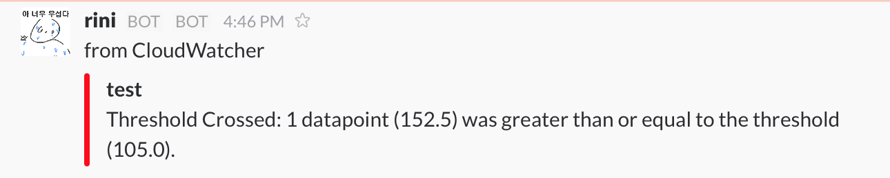

Slacker2.CloudWatcher
====

__AWS.CloudWatch integration for Slack.__<br>


<br>

Usage
----

```cs
public class MyCloudWatcher : CloudWatcher {
    public MyCloudWatcher() {
        QueueID = "YOUR_NOTI_QUEUE_ID_FROM_SQS";
    }

    public override OnReceivedAlarm(CloudWatchAlarm alarm) {
        SendColoredMessage("#help_rini", "집에불남", "#ff0000", alarm.Name, alarm.Reason);
    }
}
```